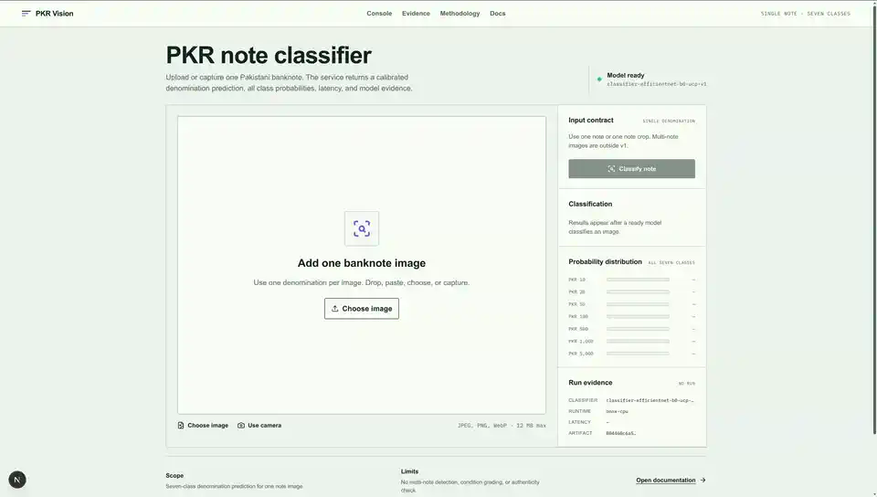

# PKR Vision

An evidence-first classifier for seven Pakistani banknote denominations: PKR 10,
20, 50, 100, 500, 1000, and 5000. V1 accepts one banknote or one banknote crop per
image and returns a calibrated seven-class probability distribution.

> **Scope boundary:** v1 does not locate or count multiple notes, calculate totals,
> assess damage, or verify authenticity. No trained model result is reported until
> its predictions and provenance artifacts exist.

## Current status

| Component | Implementation | Evidence |
|---|---|---|
| Classification data pipeline | Complete | 3,565 internal images; 327 external crops |
| EfficientNet-B0 ablation workflow | Complete | 8 feasible runs complete |
| ONNX classification API | Complete | Classifier passed quality gate |
| Next.js research console | Complete | No simulated predictions |

The canonical classification manifest SHA-256 is
`d36533b491482a3eb4b84cdf6739ab346ac6f5d619fc59e088eca4d0e0e08413`.
The selected full-data registered-augmentation classifier achieved UCP test macro
F1 `0.9962`, Abduls cross-dataset macro F1 `0.9721`, and complete ONNX top-1
agreement with PyTorch on the fixed UCP test set. Local CPU warm combined
latency averaged `6.91 ms` with p95 `8.53 ms`, keeping the classification step
comfortably below 20 ms on the measured CPU.

This latency makes the classifier a practical candidate for live-feed
classification when the incoming frame already contains one visible note or a
single-note crop. It does not add live note detection, tracking, counting, or
localization.

## Demo

Local console recording using the verified ONNX classifier and a held-out UCP
test image:



[Download the high-quality MP4](docs/assets/demo.mp4).

This demo is a classification walkthrough, not a deployment, detection, or
authenticity-verification demo.

## Research design

UCP v1 is used for image-level learning. Its existing annotations consistently
identify one denomination per eligible image, but their boxes identify local note
features rather than complete banknotes. The boxes are therefore used only to
derive a unanimous image label; they are never presented as note boundaries.

Every PKR 75 image is excluded. Exact and near duplicates are grouped before a
deterministic 70/15/15 split:

| Split | Images |
|---|---:|
| Train | 2,496 |
| Validation | 535 |
| Test | 534 |

The Abduls source is isolated from training. Its valid whole-note boxes produce
327 crops for cross-dataset evaluation after cross-source duplicate screening.
This is public cross-dataset evidence, not user-collected real-world validation.

The one-seed exploratory ablation compares pretrained EfficientNet-B0 with and
without the registered augmentation recipe at 10, 50, 100, and all available
training images. The requested 500/class level is explicitly omitted because the
smallest training class has 351 images.

The production candidate is selected using validation macro F1, then validation
ECE when macro F1 differs by less than 0.002. The selected run was the full-data
registered-augmentation condition by higher validation macro F1. Temperature
scaling was fitted on validation logits only. Test data did not select a
checkpoint, condition, or calibration parameter.

## Product quality gate

Research results are published at any score, but the API becomes ready only when:

- internal UCP test macro F1 is at least 0.90;
- Abduls cross-dataset macro F1 is at least 0.70; and
- every internal class has recall of at least 0.75.

A failed gate is not hidden: evidence remains visible while classification stays
disabled.

## Repository

```text
ml/          Data preparation, training, metrics, export, and ONNX inference
api/         FastAPI classification contract and artifact readiness boundary
web/         Next.js probability-and-evidence console
configs/     Registered sources and experiment configuration
docs/        Data/model cards, protocol, API, limitations, and operations
artifacts/   Checked-in result ledger; large runs and models remain ignored
notebooks/   Colab driver that invokes package code
tests/       Data, metric, export, API, and integrity tests
```

## Local setup

Python 3.11, 3.12, or 3.13, Node 20+, and pnpm are supported.

```bash
python3 -m venv .venv
. .venv/bin/activate
pip install -e '.[dev]'
cd web && pnpm install && cd ..
make verify
```

Copy `.env.example` to `.env.local` for local secrets. Environment files are
ignored; never commit `ROBOFLOW_API_KEY`.

## Reproduce the data

```bash
set -a
. ./.env.local
set +a

pkrvision download-roboflow \
  ucp-xi9nf pakistani-currency-note-data 1 data/raw/ucp-v1
pkrvision download-roboflow \
  abduls pkr_notes 1 data/raw/abduls-pkr-notes-v1

pkrvision prepare-classification-data \
  data/raw/ucp-v1 \
  data/raw/abduls-pkr-notes-v1 \
  --output data/processed/classification-v1

pkrvision plan-classification-ablation \
  data/processed/classification-v1/samples.jsonl \
  artifacts/mlruns/classification/plan.json
```

Raw and derived images are intentionally not committed. Acquisition records,
source checksums, sample lineage, split assignment, and derived checksums are
captured by the pipeline.

## Train in Colab

Use `notebooks/pkr_vision_colab.ipynb` from a pinned Git commit. The notebook
verifies the uploaded classification bundle, stores all runs in Drive, executes
both conditions for every feasible level, selects the full-data candidate using
validation evidence, evaluates it on Abduls, and exports ONNX.

The canonical result set includes accuracy, balanced accuracy, macro and per-class
precision/recall/F1, confusion matrices, expected calibration error, Brier score,
top-2 accuracy, and 2,000-iteration fixed-test bootstrap intervals. Those intervals
do not include training-seed variance.

## API

```bash
make api
```

- `POST /v1/classify`: multipart `image`, containing one denomination.
- `GET /v1/model-info`: readiness, model identity, preprocessing, quality gate,
  checksums, data summary, and limitations.
- `GET /health/live` and `GET /health/ready`.
- `POST /v1/analyze`: stable HTTP 410 response explaining the classification-only
  contract.

Images are decoded in memory and are not retained. A release must contain a
checksum-verified `classifier.onnx`, result summary, model card, calibration
temperature, preprocessing contract, a passing whole-test ONNX equivalence report,
and passing quality-gate evidence.

## Console

```bash
make web
```

Open `http://localhost:3000`. The console supports file selection, drag/drop,
clipboard paste, camera capture, calibrated probability inspection, latency and
artifact provenance, and JSON export. It produces no fake demo response when a
model is unavailable.

## Documentation

- [Research protocol](docs/research-protocol.md)
- [Dataset card](docs/data-card.md)
- [Model card](docs/model-card.md)
- [Training and evaluation](docs/training-and-evaluation.md)
- [API contract](docs/api.md)
- [Architecture](docs/architecture.md)
- [Hosting plan](docs/hosting.md)
- [Limitations](docs/limitations.md)
- [Release procedure](docs/release.md)

First-party code is AGPL-3.0-only. Dataset and pretrained-weight licenses remain
independent and are recorded in the dataset card and third-party notices.
